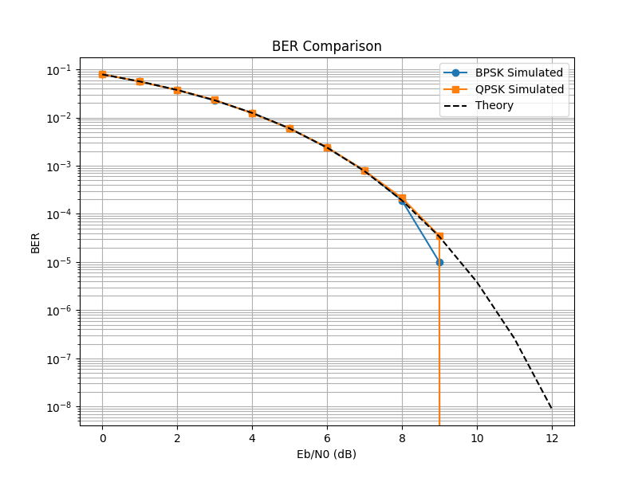
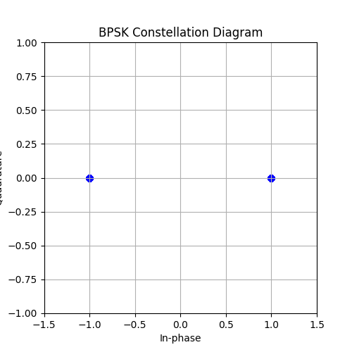
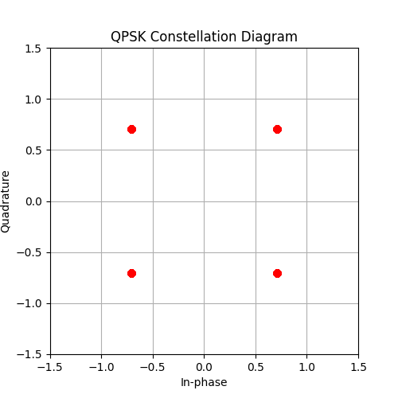
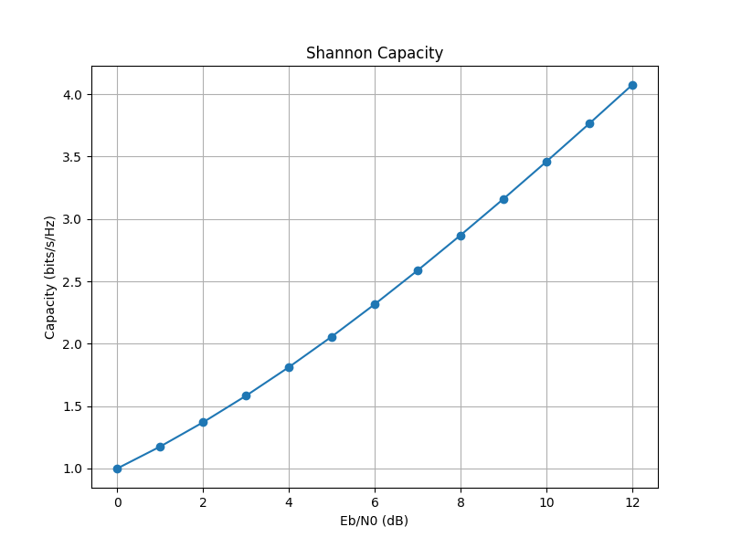
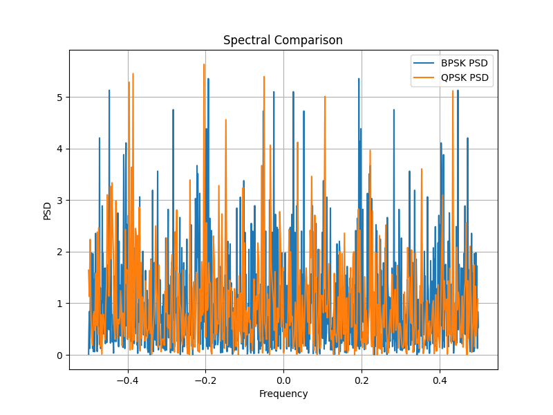

# BPSK_QPSK

## Project Overview

This project analyzes and compares Binary Phase Shift Keying (BPSK) and Quadrature Phase Shift Keying (QPSK) modulation techniques. Various performance parameters such as Bit Error Rate (BER), constellation diagrams, spectral efficiency, and Shannon capacity are studied using Python.

---

## Objectives

* Compare the BER performance of BPSK and QPSK.
* Visualize BPSK and QPSK constellation diagrams.
* Analyze spectral characteristics.
* Study Shannon channel capacity.
* Understand the efficiency of digital modulation techniques.

---

## BER Comparison

The BER performance of BPSK and QPSK is evaluated for different values of Eb/N0. Both modulation schemes provide similar BER performance under AWGN conditions.

---

## BPSK Constellation Diagram

BPSK uses two symbol points corresponding to binary 0 and binary 1.

---

## QPSK Constellation Diagram

QPSK uses four symbol points and transmits two bits per symbol, providing better bandwidth efficiency.

---

## Shannon Capacity

The Shannon Capacity graph represents the theoretical maximum information transfer rate achievable through a communication channel for different Signal-to-Noise Ratios (SNR).

---

## Spectral Comparison

The spectral comparison illustrates the bandwidth characteristics and efficiency of BPSK and QPSK modulation schemes.

---

## Technologies Used

* Python
* NumPy
* Matplotlib

---

## Source Files

* BER_Constellation.py
* BPSK vs QPSK.py
  
---
## Conclusion
This project demonstrates the performance characteristics of BPSK and QPSK modulation techniques. While both schemes show similar BER performance, QPSK offers higher spectral efficiency by transmitting two bits per symbol, making it suitable for modern communication systems.
